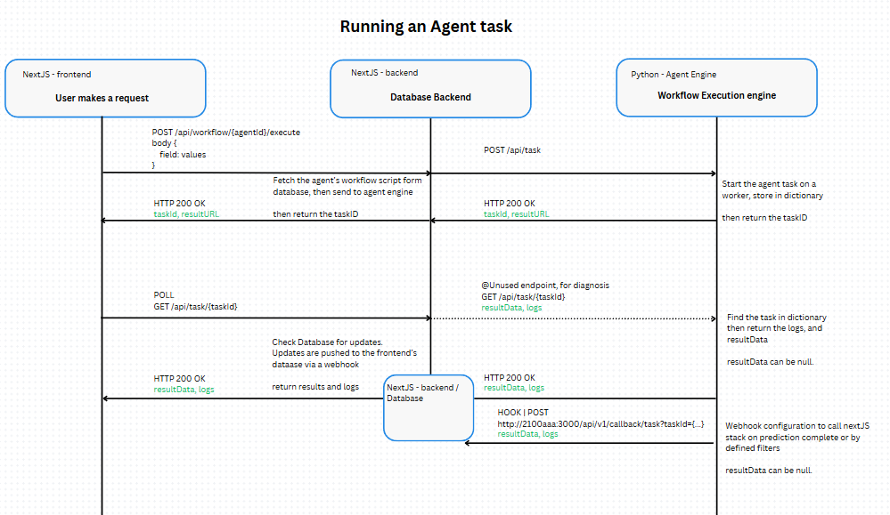

## System Architecture




### Microservice: Agent Architecture

The Agent microservice handles the execution of the agent's workflow code, this is done via fastapi's background task, and asyncio's awaitables for LLM API requests.

More details in Data Models of agent

<br><br>

## Data Models - Backend Engine

The following represent's the Engine's backend Schemas

### Agent (Engine's schema)
An Agent represents a single prompt chain with an option to trigger system events. Agents do not hold memory of previous interactions, intead is functionally equivalent to a workflow. It is a single pass operation. 

```
class Agent {
    id            String
    name          String
    description   String

    variables     Dictionary<String, String>
    promptChain   Node[]
}
```

`id` (String)\
uuid4 id string that identifies this agent.

`name` (String)\
name of the agent

`description` (String)\
descriptions for the agent

`variables` (Dictionary of String key, String value)\
Corresponds to the templating string provided by runtime nodes like `system` and `user` from `PromptNode`. Values stored here is referable to the promptChain, throughout the workflow runtime.

`promptChain` (Array of Node)\
corresponds to the chain of nodes that uses the node interface. 

<br>

### Node (Base class)
Node represents the base class of all nodes, it is meant as an interface defining the shared parameters of all nodes

```
class Node {
    type     enum
    name     String

    output   String
}
```

`type` (String, enum)\
Represents the type of node. This is used for determined casting in downstream nodes

`name` (String)\
the name of this node. Used for logging purposes

`output` (string, key)\
mapping that points to the agent's variables registry key where the model output is stored. If an unregistered key is
referenced, a new one will be created at workflow runtime.

<br>

### Prompt Node
Represents a single step within the prompt chain. This node is designed for text llms.

```
class PromptNode extends Node {
    type             enum

    system           String
    user             String

    apikey           String
    llm              enum
    model            String
    temperature      int
    maxTokens        int

    output           String
}
```

`type` (String, enum)\
Represents the type of node. This is used for determined casting in downstream nodes

`name` (String)\
the name of this node. Used for logging purposes

`system` (string)\
Represents the system prompt. This string accepts a special templating synthx using `{field}`. This is substituded in workflow runtime by referring to values stored in `variables` within `agent`.

`user` (string)\
Represents the user prompt. This string accepts a special templating synthax using `{field}`. This is substituded in workflow runtime by referring to values stored in `variables` within `agent`.

`apiKey` (String)\
The API key for this prompt node. This string accepts a special templating syntax using `{field}` which will allow the API key to be parsed at workflow runtime from `agent.variables`

`llm` (String, enum)\
Registered enum types of available LLM service provider Valid values are:
- `claude`
- `replicate`

`model` (String)\
The model available from the service provider. See Glossary of supported services for available models

`temperature` (Integer)\
The Model's temeperature settings

`maxToken` (Integer)\
The model's maximum tokens 

`output` (string, key)\
mapping that points to the agent's variables registry key where the model output is stored. If an unregistered key is
referenced, a new one will be created at workflow runtime.

<br>

### Return Node
Represents the terminal node, which an output can be listed for return

```
class ReturnNode extends Node {

    @Override
    output          Array<String>
}
```

`output` (Array of String key)
List of keys from the shared context variable to return within the task object once the workflow finishes

<br>

### Parser Node `@experimental`
Represents an input output filter node within the chain

```
model ParserNode {
    rawData       String
    parser        enum

    schema        String
    
    field       Dictionary<String, String>
    output      Dictionary<String, String>
}
```

`field` (Dictionary of key string, value string)\
Corresponds to the templating string provided by `rawData`. 


`output` (Dictionary of key string, value string)\
mapping that points to the next Node's field property.

<br>

### System Events @experimental
Events are API calls that will occur at stage of the agent's execution

```
class EventNode extends Node {
    endPoint    String
    method      String
    data        String

    field       Dictionary<String, String>
    output      Dictionary<String, String>
}
```

`endPoint` (String)\
The API endpoint to call. Uses the special templating syntax string.

`method` (string | enum)\
The API request method. `GET`, `POST`, `PUT`, `DELETE`, etc

`data` (string)\
The JSON template for making the request. Uses the special templating syntax string. During runtime, this string will be parsed back to JSON

`field` (Dictionary of key string, value string)\
Corresponds to the templating string provided by `endPoint` and `data`. 

`output` (Dictionary of key string, value string)\
mapping that points to the next Node's field property.

<br>

### Task 
The Task object of the running agent

```
class Task {
    id       String
    logs     Array<String>
    output   Dict<String, Object>
}
```

<br><br>

## Data Models - Frontend 2100aaa public
The following represents the schema and data models for the frontend stack

```

```


<br><br>

## Business Logic

<br>

### Database Serializations
Due to the dynamic nature of the agent, nodes, and task objects. Agents, nodes, and tasks are serialized differently when stored in the database. The following represents an executive summary of the database model, and its corresponding JSONified objects

```
model Agent {
  id              String      @id @default(cuid())
  name            String      @unique
  description     String?

  // core fields used by backend
  variables       String                               // JSON String of the variables used by workflow
  workflow        String                               // JSON string

  // Additional fields used by frontend

  task            Task[]
}
```

`workflow` (String, stringified JSON)\
Maps to the `promptChain` field of the equivalent workflow object expected within the backend engine.

`variables` (String, stringified JSON)\
Maps to the `variables` field of the equivalent workflow object expected within the backend engine.

<br>

```
model Task {
  id             String       @id @default(cuid())
  name           String       
  agentId        String

  logs           String                               // JSON string
  output         String                               // JSON string

  agent          Agent        @relation(fields: [agentId], references: [id], onDelete: Cascade)
}
```

`logs` (String, stringified JSON of `Array<String>`)\
Maps to the `logs` field of the equivalent Task object sent from the backend engine.

`output` (String, stringified JSON of `Dict<String, Object>`)\
Maps to the `output` field of the equivalent Task object sent from the backend engine. This is JSONified as a dictionary of key value pairs


<br><br>

### Making an Agent

As an example, an agent that summerizes the plot of the movie and list the characters. Can be constructed via the following nodes. Nodes are listed as pseudo code.

```
Node 1 PromptNode

systemPrompt: "You are a helpful assistant for creating a list of plots form a movie script denoted by ### \nPlease list the plots by enclosing them with the <plot></plot> syntax"
userPrompt: "### ${script} ###"

field: {
    script: "{entryPoint}"
}

output: {
    plots: "{output}",
    script: "{script}"
}
```

Each node denotes the output dictionary, and its current input with the above formatting


```
Node 2: PromptNode

systemPrompt: "You are a helpful assistant for creating a brief summary of a movie plot denoted by <plot></plot>"
userPrompt: "Movie script ${script} \n\nPlot ${summary}"

field: {
    script: "{script}",     // `{script}` came from prev node output
    summary: "{plots}"      // `{plot}` came from prev node output
}

output {
    summary: "{output}"      // `{output}` is a preserved keyword, of this node's output
}
```

Here, we generate the list of characters, but, we are also passing along the generated summary from the previous stage

```
Node 3 PromptNode

systemPrompt: """
You are a helpful assistant for listing all the characters of this movie script denoted by ### 

Please respond in JSON with the following schema:
{
    "characters: ["Alex", "Steve"]
}
"""
userPrompt: "Movie script ${script}"

field: {
    summary: "{summary}",
    script: "{script}",
}

output: {
    rawData: "{output}",
    summary: "{summary}"
}
```

Here we parse the LLM output into a json format and verify it with the schema property of this node, which is also just a string object.

The JSON is then stringify again and pass as a string within one of the output's field

We pass the generated summary information to the next node. 

```
Node 4 ParserNode
rawData: "{rawData}"
parser: "JSON",

schema: "
{
    "character": "Array<String>"
}
"

field: {
    rawData: "{rawData}",
    summary: "{summary}"
}

output: {
    lisOfCharacters: "{output}",
    summary: "{summmary}",
}
```


In the last node, we fire an event, which in this case is a single API endpoint. Here, the data property of this node is also just actually a string with our templating syntax, which will be parsed, and templated at runtime into a JSON object. 

```
Node 5 EventNode

endPoint : "/prediction/movie-script/result"
method: "POST"
param: null
data: {
    "characters": {characters},
    "summary": {summary},
}

field: {
    characters: "{listOfCharacters}" ,  // came from prev node
    summary: "{summary}"
}
```


### Agent and workflow


<br><br>


# API: Backend Agent Microservice
The following API backend is a protected internal system. It is not intended to be accessed outside of docker without the proxy pass of the frontend.
Only accessible from within the docker network.

<br>

## `http://engine:8000/` Docker

### GET
Basic health check to ensure the engine is running

<br>

## `http://engine:8000/api/task` Docker

### POST
Creates an agent workflow task

```
POST /api/task

header {
    "Content-Type": "application/json"
}

body {
    "name": "My agent"
    "variables": {
        "replicateAPI": "apikey",
        "genre": "Sciene fiction",
        "prompt": "Write a nice story",
        "context": ""
    }
    "promptChain": [
        {
            "type": "prompt",
            "name": "Sypnosis",

            "system": "You are a story development expert creating a synopsis for a {genre} film according to the user's request",
            "user": "{prompt}",
            "apikey": "{replicateAPI}",
            "llm": "replicate",
            "model": "google-deepmind/gemma-3-27b-it",
            "temperature": 1,
            "maxTokens": 2000,
            "output": "context",
        },
        {
            "type": "prompt",
            "name": "character dev",

            "system": "You are a character development specialist for {genre} films. Given the film's sypnosis enclosed in ### and the user's main request, \n Write the film's character development plans",
            "user": "### {context} ### {prompt}",
            "apikey": "{replicateAPI}",
            "llm": "replicate",
            "model": "google-deepmind/gemma-3-27b-it",
            "temperature": 1,
            "maxTokens": 2000,
            "output": "context",
        },
        {
            "name": "Return",
            "type": "return",
            "output": "context"
        }
    ]
}
```

`name` (String name)\
Identifier for the agent task

`promptChain` (Array of Node, required)\
Represents the main workflow prompt chain node. Where each node is a subclass to the Base Node. Refer to Data Model for description of the Node fields

`variables` (dict of String key, String value)\


Response:
```
200 {
  "id": "fbc5f047-dde3-4ec9-b8bc-e1cd4ec4a6d7",
  "logs": [
    "Sypnosis: Running",
    ...
  ],
  "output": ""
}
```

`200`\
Returns the relevant task object which reports the workflow execution's logs and output

<br>

## `http://engine:8000/api/task/{taskId}` Docker

### GET
Retrives the relevant task object for an agent's execution

```
GET /api/task/fbc5f047-dde3-4ec9-b8bc-e1cd4ec4a6d7
```

Response:

```
200 {
  "id": "fbc5f047-dde3-4ec9-b8bc-e1cd4ec4a6d7",
  "logs": [
    "Sypnosis: Running",
    ...
  ],
  "output": ""
}
```

<br><br>

## Webhook to frontend
For every task completed, a webhook is sent to the frontend to record the workflow's logs, and prediction sessions. 

> ![note]
> The request body is a task object. Refer to Data Model section for more detail

The following represents the webhook's request body:

```
POST http://2100aaa:3000/api/v1/callback/task?tastkId=""

header {
    "Content-Type": "application/json"
}

body {
    "id": "fbc5f047-dde3-4ec9-b8bc-e1cd4ec4a6d7",
    "logs": [
        "Sypnosis: Running",
        ...
    ],
    "output": ""
}
```

`taskId` (params)\
The URL params passed as part of the task being run


<br><br>


# API: Frontend NextJS
The following API endpoints are public APIs meant to serve public users to run an agent.

## `/api/v1/agent` API Key Required

### GET
Retrieves a list of agents

Querying url parameters are as follows:


### POST
Create a new agent

<br>

## `/api/v1/agent/{agentId}` API Key Required

### GET
Retrieves the relevant information for the agent

### POST
Updates the current agent. Updates are rewrites, thus, the frontend needs to send the full revision JSON for the agent

### DELETE
Deletes an agent from the database


<br>

## `/api/v1/workflow/{agentId}` API Key required

### GET
Retrives the relevant agent's schemas

### POST
Run the given agent, based on the a list of required inputs for the agent for execution.

```
POST /api/v1/workflow/movie-script

header {
    "Content-Type": "application/json",
    "apikey": "apikey123"
}

body {
    "input": {
        "apikey": "apikey",
        "user": "user prompt",
        "system": "system prompt"
    }
}
```

`agentId` (String, required | Url params)\
The agent's ID. This is required. You can find a list of all our agents in the documentations

`apikey` (String, required | Header)\
The API key for running this operation.

`input` (Dict, key-value, required)\
The required inputs for running this agent. The exact keys and values for this input field is unique and differs depending on the agents. You can look up
the required inputs in the agent's description page

<br>

Response

```
201 {
    "id": "fbc5f047-dde3-4ec9-b8bc-e1cd4ec4a6d7",
    "logs": [
        "Sypnosis: Running",
        ...
    ],
    "output": ""
}
```

`201`\
Returns the task object for this agent's execution

<br>

## `/api/v1/task/{taskId}` API Key required

### GET
Retrieves the relevant user's workflow outputs, and progress report.

